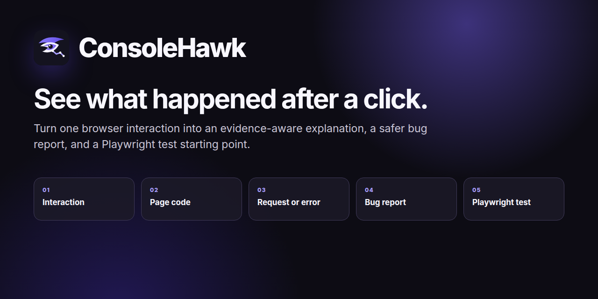

# ConsoleHawk



[](https://github.com/J-Jessen/consolehawk-chrome-extension/actions/workflows/ci.yml)

[See the public beta](https://j-jessen.github.io/consolehawk-chrome-extension/) · [Download the extension](https://github.com/J-Jessen/consolehawk-chrome-extension/releases/tag/v0.11.1-beta.1) · [Try it in 10 minutes](QUICK_TEST.md) · [Volunteer for a guided test](https://github.com/J-Jessen/consolehawk-chrome-extension/issues/new?template=guided-beta-session.yml)

Current build: **0.11.1**

Public beta: **v0.11.1-beta.1**

> See what happened after a click.

A local-first Chrome Manifest V3 proof-of-concept for the product hypothesis:

> Record one interaction or a user journey → understand what happened → create a safe bug report and regression test.

This is a public-beta instrumentation experiment, not yet a production extension. It tests whether a useful trace can be assembled from a selected DOM element, JavaScript event-listener pauses, network traffic, runtime exceptions, navigation, and DOM mutations. It supports desktop Chrome 118 and newer.

## Why try it

- Follow one interaction from the page into handlers, requests, asynchronous work, navigation, and visible page changes.
- Understand a failed request or JavaScript error before opening the full technical trace.
- Turn a short user journey into a privacy-reviewed Markdown or JSON bug report.
- Generate a Playwright regression-test starting point from the recorded steps.
- Keep traces local unless you explicitly copy, download, or open a reviewed GitHub draft.

## What the current build does

1. Requests persistent access only to the current website when the user selects an element, then injects the picker on demand.
2. Records one click/tap, keyboard action, input change, form submission, or drop; automatic detection remains the default.
3. Attaches Chrome DevTools Protocol through `chrome.debugger`.
4. Pauses and immediately resumes at the chosen interaction listener, retaining useful call frames.
5. Observes requests, responses, console warnings/errors, exceptions, page/frame navigation, and DOM mutations for 3.5 seconds.
6. Builds a chronological timeline with explicit causality confidence.
7. Resolves available source maps locally and shows authored source locations.
8. Detects the nearest owning React component and shows component path, prop names/types, and state shape without capturing prop or state values.
9. Instruments `setTimeout` scheduling and callbacks with asynchronous call stacks. If Chrome does not expose the experimental CDP breakpoint domain, a temporary local MAIN-world hook is used automatically.
10. Produces a deterministic summary and schema-versioned, privacy-sanitized JSON export.
11. Scores trace coverage and shows concrete diagnostics for missing evidence, incomplete responses, timer fallbacks, and source-map failures.
12. Labels every observed network event as same-origin, cross-origin, or unknown-origin relative to the traced page.
13. Builds a deterministic primary chain from explicit event relationships, offers a dedicated filter, and keeps timing-only correlations outside that chain.
14. Keeps up to 25 completed traces within a 5 MB local budget, with visible usage, automatic oldest-first eviction, history disable, delete, clear, and version-validated JSON import controls.
15. Provides reviewed, automatically redacted JSON downloads and redacted Markdown reports.
16. Correlates Promise-parented network initiators and privacy-safe WebSocket lifecycle/frame metadata without storing message content.
17. Uses trace schema version 2 with explicit relationship, capture-method, and privacy metadata plus local migration of version 1 imports.
18. Uses semantic, keyboard-accessible side-panel controls with light/dark color support and automated accessibility checks.
19. Restores privacy-sanitized visible trace state from session storage if the extension service worker restarts.
20. Presents a diagnostic plain-language explanation—covering the interaction, exact failed request, HTTP/browser/JavaScript error, meaning, first check, source function, and visible result—and keeps raw timing, confidence, and browser evidence behind an expandable technical trace.
21. Attaches supported Worker and cross-origin iframe execution contexts to capture their request, error, and handler metadata without reading message or frame content.
22. Adds trace naming, search, quality/problem filters, and two-trace comparison to local history.
23. Offers an optional second opinion from Chrome's on-device Prompt API after showing the exact redacted input; no cloud fallback is used.
24. Collects per-trace usefulness and clarity feedback locally, redacts common credentials before storage, and exports it only on request.
25. Records a multi-step journey of up to 30 supported interactions for up to two minutes, including same-origin page navigation, while omitting typed values and payloads.
26. Builds a locally redacted Markdown/JSON bug report with steps to reproduce, expected result, actual result, browser context, diagnosis, and evidence quality.
27. Opens a reviewable, prefilled GitHub issue without storing a GitHub token or submitting anything automatically.
28. Generates a Playwright regression-test skeleton with stable captured selectors, safe placeholders for private input, and a user-visible assertion when evidence supports one.

All trace processing is local. The current build has no backend, analytics, login, or remote AI call. The optional AI feature runs Chrome's local model and remains unavailable when that browser capability or device model is unavailable.

## Public beta

Begin with the [public beta page](https://j-jessen.github.io/consolehawk-chrome-extension/), which includes an actual product walkthrough, hosted safe demos, and a 15-minute guided-test option. Download the installable archive from the [v0.11.1-beta.1 release](https://github.com/J-Jessen/consolehawk-chrome-extension/releases/tag/v0.11.1-beta.1), extract it, and begin with `START_HERE.md`. Use the release asset named `consolehawk-v0.11.1-beta.1.zip`, not GitHub's automatic source archive.

The unlisted Chrome Web Store beta is being prepared to replace the temporary developer-mode installation with a one-click install. The current Web Store copy, permission justifications, privacy disclosures, reviewer steps, and submission checklist are in `CHROMEWEBSTORE.md`.

The repository is public so testers can inspect the code, download the current release, report sanitized problems, and propose changes through pull requests. Public visibility does not give anyone write access to the repository.

ConsoleHawk is source-available for beta evaluation, but it is not currently open source. The public beta release may be downloaded and run for evaluation and feedback. No permission is granted to redistribute the code, publish modified versions, or reuse it in another product. See [LICENSE.md](LICENSE.md).

Never post credentials, customer data, private URLs, raw traces, or unreviewed exports in a public issue. Use [private vulnerability reporting](https://github.com/J-Jessen/consolehawk-chrome-extension/security/advisories/new) for a security or privacy exposure.

## Install

1. Open `chrome://extensions` in Chrome.
2. Enable **Developer mode**.
3. Run `npm run build`, then choose **Load unpacked** and select the generated `dist` directory. A GitHub release archive can be extracted and loaded the same way.
4. Open a normal website and click the extension icon to open its side panel.
5. Choose **Select element for one-step trace** and approve that website the first time. Previously approved websites do not prompt again.

For a complete flow, choose **Record a user journey**, perform the relevant steps on that website, and choose **Stop journey and build report**. Add expected and actual behaviour, review the redacted report, then download it, open a GitHub draft, or download the generated Playwright test.

Chrome will show a debugging banner while a 3.5-second trace is active. This is expected: deep runtime tracing requires the `debugger` permission.

## Run the deterministic demo

The zero-setup version is hosted at `https://j-jessen.github.io/consolehawk-chrome-extension/demo/`. Use the local command below only when developing or when GitHub Pages is unavailable.

Run this command from the project root:

```bash
python3 -m http.server 4173 --bind 127.0.0.1 --directory demo
```

Then open exactly `http://127.0.0.1:4173/`, select **Complete order**, leave interaction detection on **Detect automatically**, choose **Record selected interaction**, and click the button again.

Expected evidence:

- a plain-language explanation connecting the click, code, data request, and page result;
- a direct click interaction;
- one or more click-listener frames, including `submitOrder` when Chrome exposes that frame;
- `GET /order.json?traceDemo=1` and its `200` response;
- button and result DOM mutations.

### Try an intentional failed request

With the same demo server running, open `http://127.0.0.1:4173/failure.html`. Select **Send failing request**, choose **Record selected interaction**, and click the button again.

The page deliberately requests a missing JSON file. The expected trace includes `GET /missing-order.json?traceDemo=failure`, a `404` response, the handled error message shown on the page, and a contextual explanation that identifies the failed request. This failure is local and does not affect real data.

### Try the complete report workflow

Open `http://127.0.0.1:4173/multi-step.html`, choose **Record a user journey**, and follow the three instructions on the page. Stop the journey after the expected 404 appears. The result should contain ordered reproduction steps, a detailed failure explanation, a safe bug-report form, GitHub draft action, and Playwright download. Enter only dummy text; the generated report must not include the field value.

## Run the React delegation demo

The second test target uses React 19 with a delegated `onClick`, an authored async handler, a fetch request, and a timer-delayed state update.

```bash
python3 -m http.server 4175 --bind 127.0.0.1 --directory demo-react
```

Open `http://127.0.0.1:4175/`, select **Complete React order**, record one interaction, and click it again.

Expected evidence:

- a direct click interaction;
- React's delegated event dispatcher as the browser listener boundary;
- `handleReactCheckout` in the request initiator stack;
- `GET /order.json?reactTrace=1` and its `200` response;
- `setTimeout scheduled · handleReactCheckout()` followed by `setTimeout callback · applyConfirmedOrder()`;
- immediate React state mutations followed by a delayed final render around 280 ms later.

The checked-in `app.js.map` maps the handler, timer schedule, and callback frames back to `src/main.jsx` when Chrome exposes those generated frames.

## Run the validation corpus

The automated corpus starts a fixture server and headless Chrome, loads the unpacked extension, runs all 31 interactions, and evaluates each captured trace:

```bash
npm run test:e2e
```

The full matrix and fixed pass criteria are in `CORPUS.md`. Set `CORPUS_CASE` to an ID from that file to run a single scenario.

## Test

```bash
npm test
```

GitHub Actions runs the same test suite and rebuilds the checked-in React demo on every push and pull request.
After the tests pass, CI also creates an installable `consolehawk-extension` artifact containing runtime files only. A matching `v*` tag creates a GitHub release archive automatically.

The public beta plan, recruitment messages, tester instructions, and distribution guide are in `BETA.md`, `TESTER_RECRUITMENT.md`, `BETA_TEST_GUIDE.md`, and `GITHUB_SHARING_GUIDE.md`.
Privacy and security details are documented in `PRIVACY.md` and `SECURITY.md`. Contribution and verification requirements are in `CONTRIBUTING.md`.
The versioned export contract and migration rules are documented in `TRACE_SCHEMA.md`.

## Project structure

- Extension runtime: root-level `manifest.json`, service worker, content script, side panel, and trace modules.
- `tests/`: deterministic Node tests for trace normalization, source maps, privacy, React ownership, and corpus evaluation.
- `demo/`: native listener and successful fetch target.
- `demo-react/`: React delegation, fetch, timer, and source-map target.
- `demo-corpus/`: deterministic mutation, timer, network, error, navigation, and minification fixtures.
- `e2e/`: the browser runner that drives the extension without manual interaction.
- `CORPUS.md`: automated validation matrix and current go/no-go evidence.

## Known limits

- The default plain-language explanation is deterministic and intentionally conservative. “Observed after interaction” means the event happened in the same trace window but was not proven to be caused by the interaction.
- A request is “direct” only when its CDP initiator stack matches a captured interaction-handler frame. The primary chain follows explicit parent relationships; timing-only correlations remain visible but are excluded. Time proximity is not proof of causality.
- Framework event delegation can expose a framework dispatcher rather than the authored handler.
- Available source maps are fetched and applied locally. Missing, inaccessible, malformed, or unsupported maps fall back to deployed JavaScript locations.
- Timer capture prefers CDP instrumentation. On Chrome builds without `EventBreakpoints`, the extension temporarily wraps supported MAIN-world async APIs and restores them on completion or at the trace safety limit (10 seconds for a single trace and about two minutes for a journey).
- Public state and copied JSON retain function names, deployed locations, source-mapped locations, and async parents, but remove CDP `callFrameId`, scope objects, receiver objects, and return values.
- Promise continuations, queued microtasks, `setTimeout`, `setInterval`, and `requestAnimationFrame` boundaries are explicit when the browser or trace-scoped fallback exposes them. Worker and WebSocket lifecycle/message direction are captured without content. Worker and cross-origin iframe internals require Chrome's flat debugger-session support; the trace reports partial coverage when unavailable.
- Same-document History API and fragment navigation are captured through `Page.navigatedWithinDocument` when the connected Chrome build exposes that experimental event.
- Cross-origin iframe request/error/handler metadata is captured when Chrome exposes the frame as a related target. Frame DOM and body content, sandbox-blocked internals, browser-internal pages, and closed shadow roots remain outside this beta.
- Site access is granted to one exact HTTP or HTTPS origin at a time. Cross-origin source maps may remain unavailable until their own host is explicitly supported; tracing does not silently expand access.
- Opening DevTools on the traced tab detaches `chrome.debugger`.
- Chrome's on-device Prompt API requires Chrome 148+ on a supported desktop device and may require an initial model download. Chromium-based browsers that do not expose `LanguageModel`, including the current Brave beta-test setup, receive an actionable browser-specific explanation instead. The deterministic explanation always remains available; there is no cloud fallback.
- The extension declares HTTP and HTTPS hosts as optional and requests only the active website from a direct **Select element for one-step trace**, **Record selected interaction**, or **Record a user journey** action. Chrome's extension settings can revoke previously granted sites.
- Multi-step recording stops when the active tab leaves the website whose origin was granted. Cross-origin journeys must be captured as separate reports.
- Multi-step recording ignores typed character keydowns and does not arm Chrome's keydown listener breakpoint, preventing normal typing from repeatedly pausing the page. Named control keys still appear as reproduction steps; use a one-step keyboard trace when handler call frames are required.
- Generated Playwright tests are privacy-safe starting points, not guaranteed final tests. Values and complex drop interactions require explicit non-production fixtures, and TODO comments remain where the trace cannot infer a safe assertion.

## Go/no-go test

Run the beta against a test corpus of at least 20 interactions:

- native DOM listener;
- React delegated listener;
- async fetch success/failure;
- timer-delayed mutation;
- client-side navigation;
- production/minified bundle with and without source maps.

Proceed only if at least 80% produce a trace that saves a developer meaningful manual inspection. If the output repeatedly collapses to HTML/CSS plus unrelated requests, stop or narrow the product to owned/local codebases.
